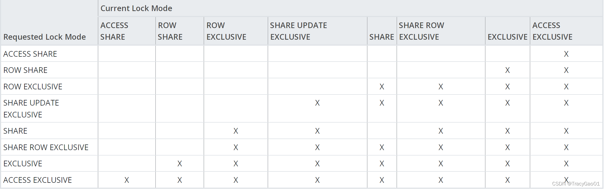
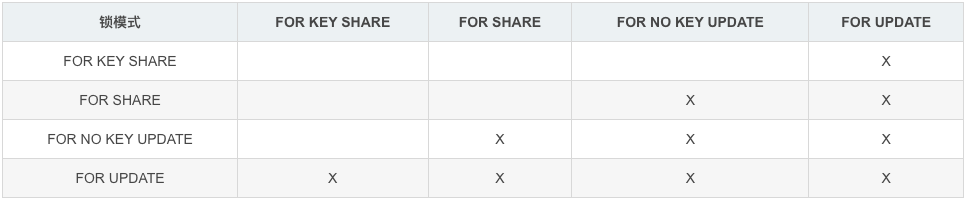

# PG LOCKS

## TABLE LOCK
- ACCESS SHARE
- ROW SHARE
- ROW EXCLUSIVE
- SHARE UPDATE EXCLUSIVE
- SHARE
- SHARE ROW EXCLUSIVE
- EXCLUSIVE
- ACCESS EXCLUSIVE

### ACCESS SHARE
- 1、SELECT 产生的锁
- 2、与ACCESS EXCLUSIVE冲突

### ROW SHARE
- 1、SELECT FOR UPDATE 、SELECT FOR SHARE 产生的锁
- 2、与EXCLUSIVE 、ACCESS EXCLUSIVE冲突

### ROW EXCLUSIVE
- 1、UPDATE、DELETE、与INSERT 产生的锁
- 2、与SHARE、SHARE ROW EXCLUSIVE、EXCLUSIVE、ACCESS EXCLUSIVE冲突

### SHARE UPDATE EXCLUSIVE
- 1、VACUUM (WITHOUT FULL)、ANALYZE、CREATE INDEX CONCURRENTLY、CREATE STATISTICS、COMMENT ON、 ALTER TABLE VALIDATE 、 OTHER ALTER TABLE VARIANTS 产生的锁
- 2、与SHARE UPDATE EXCLUSIVE、SHARE、SHARE ROW EXCLUSIVE、EXCLUSIVE、ACCESS EXCLUSIVE冲突

### SHARE
- 1、CREATE INDEX 产生的锁
- 2、与ROW EXCLUSIVE、SHARE UPDATE EXCLUSIVE、SHARE ROW EXCLUSIVE、EXCLUSIVE、ACCESS EXCLUSIVE冲突

### SHARE ROW EXCLUSIVE
- 1、CREATE COLLATION、CREATE TRIGGER、AND MANY FORMS OF ALTER TABLE 产生的锁
- 2、与ROW EXCLUSIVE、SHARE UPDATE EXCLUSIVE、SHARE、SHARE ROW EXCLUSIVE、EXCLUSIVE、AND ACCESS EXCLUSIVE 冲突

### EXCLUSIVE
- 1、刷新物化视图REFRESH MATERIALIZED VIEW CONCURRENTLY 产生的锁
- 2、与ROW SHARE、ROW EXCLUSIVE、SHARE UPDATE EXCLUSIVE、SHARE、SHARE ROW EXCLUSIVE、EXCLUSIVE、ACCESS EXCLUSIVE冲突

### ACCESS EXCLUSIVE
- 1、DROP TABLE、TRUNCATE、REINDEX、CLUSTER、VACUUM FULL、REFRESH MATERIALIZED VIEW (WITHOUT CONCURRENTLY) 产生的锁
- 2、与ACCESS SHARE、ROW SHARE、ROW EXCLUSIVE、SHARE UPDATE EXCLUSIVE、SHARE、SHARE ROW EXCLUSIVE、EXCLUSIVE、ACCESS EXCLUSIVE冲突

## ROW LOCK
- FOR KEY SHARE
- FOR SHARE
- FOR NO KEY UPDATE
- FOR UPDATE

### FOR UPDATE
对于所有的 FOR UPDATE 操作，对于被检索的数据行进行 FOR UPDATE 行锁锁定，阻止其他事务对持有 FOR UPDATE 行锁记录进行更新。在 RR 和 SERIALIZABLE 隔离级别下，如果一个被 FOR UPDATE 锁定的行在当前事务开始后被修改，该事务会抛出异常报错。对于 UPDATE、DELETE 操作同样需要获取 FOR UPDATE 行模式锁。

### FOR NO KEY UPDATE
与 FOR UPDATE 行模式锁类似，但是其锁范围相对较弱。对于不需要获取 FOR UPDATE 行锁资源的所有 UPDATE、DELETE 操作都会持有该行模式锁。在 RR 和 SERIALIZABLE 隔离级别下，如果一个被 FOR UPDATE 锁定的行在当前事务开始后被修改，该事务会抛出异常报错。

### FOR SHARE
对于检索记录添加 SHARE LOCK，该模式锁资源会阻塞其他事务对持有锁记录进行 UPDATE、DELETE、SELECT FOR UPDATE、FOR NO KEY UPDATE，但允许其他事务并发添加FOR SHARE 或者 FOR KEY SHARE。

### FOR KEY SHARE
相对于FOR SHARE，该模式锁相对更加弱一些,他允许其他事务并发持有 FOR NO KEY UPDATE 模式锁资源。